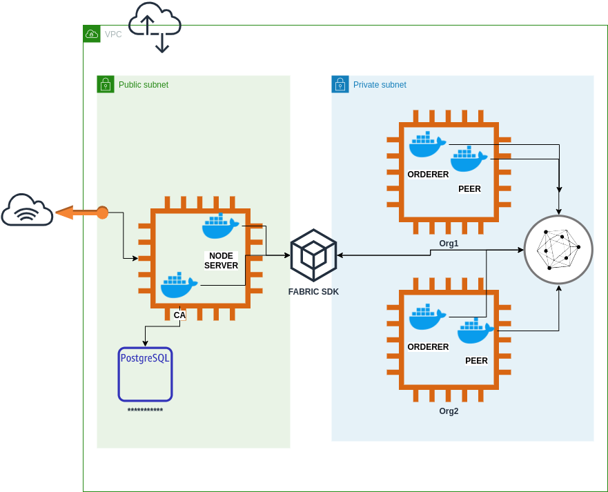

# CRM (Customer Relationship Management Software)

A CRM (Customer Relationship Management) is a software that can manage every relationship and interaction with your target customers. The main benefits of a sturdy CRM system are like Improved Relationships, Healthy Pipeline, Improved Communication.
 
This project main to solves the problem of trust between salespeople, administration. Project only provide [API](#APIDocs) for storing details of leads and deal which only can be accessed by the creator or owner of the leads/deals.
 
This project can also be helpful to fabric developers who wants to implement a production-ready fabric(v2.0) on [AWS](#Architecture)

>## Table of Contents

- [Installation](#installation)
- [Status](#status)
- [Tech Stack](#Stack)
- [Contributors](#Contributors)

## Installation

### Clone
- Clone this repo to your local machine using `https://github.com/Zzocker/CRM.git`

### Install docker (Optional)
- chmod +x ./docker.sh
- ./docker.sh
- usermod -a -G docker ${USER}

### Fabric network

#### Configuration of fabric network (v2.0)
> 2 Orderer using **raft** consensus

> 1 org with one peer name devpeer. devpeer is using **Couchdb** as worldstate.

> Chaincode written in **Golang**

#### Start Docker Containers and etup the peers

    > cd network/deployment/
    > docker-compose -f docker-compose-cli.yaml -f docker-compose-orderer.yaml -f docker-compose-peerca.yaml up -d
    > docker exec -it cli bash
    > cd channel-artifacts/
    > chmod +x chaincodetest.sh
    > ./chaincodetest.sh

#####  Install chaincode on peer

    > ./installChaincode.sh

### Fire up the APIs
    
    > cd api
    > npm i
    > npm run dev

## Status

:white_large_square: Chaincode development
- :heavy_check_mark: [Lead model](#leadmodel)
- :heavy_check_mark: [Deal model](#dealmodel)
- :heavy_check_mark: Lead and Deal Function 
- :white_large_square: Access control for Admin, salesperson,manger on deals and leads 

:heavy_check_mark: Network configured

:heavy_check_mark: Middleware (nodejs server)

- :heavy_check_mark: [Lead APIs](#APIDocs)
- :heavy_check_mark: [Deal APIs](#APIDocs)
- :heavy_check_mark: Containerization of Node server

:white_large_square: Deployment on AWS
- :heavy_check_mark: Tested
- :white_large_square: Dev running

## Documentation

### Architecture

### APIDocs

## Stack
- Golang
- nodeJs
- Docker
- Hyperledger Fabric
- AWS (VPC and EC2)

---
## Contributors

 <a href="https://github.com/Zzocker" target="_blank">**Pritam Singh**</a> 

   

---

